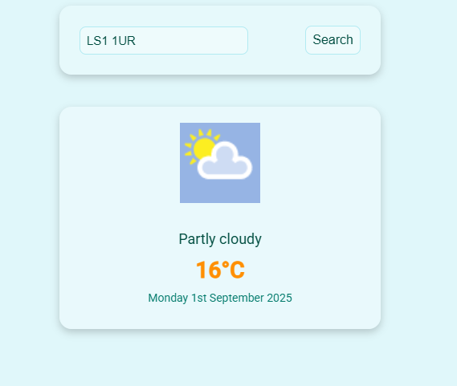

# 🌦️ Weather Dashboard

A simple weather dashboard built with vanilla JavaScript. Users can enter a postcode to get the current weather conditions, powered by the [Weatherstack API](https://api.weatherstack.com/).

🔗 [Live Demo](https://adeelh12.github.io/Weather_App/)  
📂 [GitHub Repo](https://github.com/AdeelH12/Weather-Dashboard)

---

## ✨ Features
- ⌨️ Enter a postcode to search for weather.  
- 🌡️ Displays current temperature and weather description.  
- 📍 Location-based results powered by the Weatherstack API.  
- ❌ Error handling for invalid postcodes or failed requests.  
- 📱 Mobile-first, responsive design.  

---

## 🛠️ Tech Stack
- HTML5  
- CSS3  
- JavaScript (Vanilla JS)  
- Weatherstack API  

---

## 📸 Screenshot



---
## 🚀 Getting Started

Clone the repository and open `index.html` in your browser:

```bash
git clone https://github.com/AdeelH12/Weather-Dashboard.git
cd Weather-Dashboard

